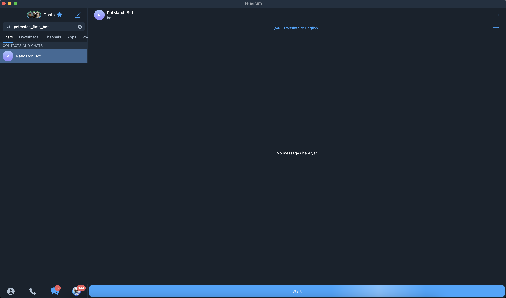

## [MVP] Бот по поиску животного из Московских приютов
Если животное вам понравилось - нажмите на кнопку "Лайк" и свяжитесь с приютом. 

В тестовой версии вы можете посмотреть животных только из приюта в [Обухово](https://newdomcat.ru/кошки/)

[](demo.mp4)

#### Как запустить проект локально

Перед запуском сервисов нужно добавить необходимые переменные в файл .env
```
PETS_DATABASE_PATH=https://storage.yandexcloud.net/pet-match-s3-storage/PetMatch/db.json
BOT_TOKEN=<BOT_TOKEN>
API_URL=http://127.0.0.1:13175
ACCESS_TOKEN=<VK_ACCESS_TOKEN>
SB_AUTH_DATA=<GIGACHAT_AUTH_DATA>
```

Параметры в <> нужно заменить на ваши значения


Для запуска Api используйте команду 
```
python api.py
```

Для запуска Телеграмм бота используйте команду 
```
python bot.py
```
x
Протестировать работу бота можно через телеграмм, написав start боту https://t.me/petmatch_itmo_bot
